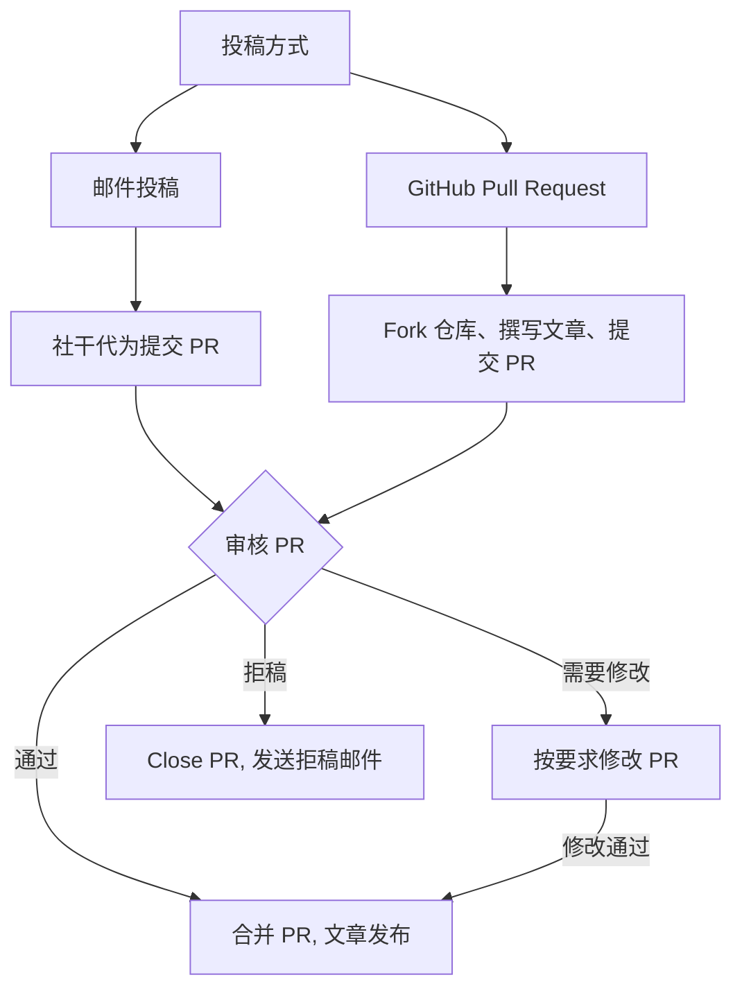

# 投稿指南

我们欢迎所有数学爱好者向我们投稿文章！
内容包括但不限于题目的分析求解、套题上传, 
以及其他与数学相关的内容.

## 投稿流程

一般地, 投稿者需要先 fork 本仓库, 然后在自己的仓库中编写文章,
最后开启 Pull Request 向我们提交文章.

我们的社干会尽快审核并合并您的文章.

如果你不了解 Git 操作, 你也可以通过邮件将稿件发送至 [邮箱](mailto:hyzxmath@outlook.com), 由社干代为提交.
在收到邮件后我们尽快处理并发送回复邮件通知审核结果, 或者你直接在 Pull Request 页面查看审核进程.

> [!IMPORTANT]
> 本协会的审核工作由学生干部利用课余时间完成，无法保证实时处理, 导致我们的审核周期比较长, 可能一两天甚至几周, 请耐心等待 awa



## 内容要求

1. 文章内容应该与数学相关
2. 文章内容应该为原创, 或者已经获得原作者授权
   - 转载的文章***必须***特别在 Markdown Front Matter 的 license 字段和 PR 描述内注明授权信息
3. 投稿文章***必须***放到 `content/external` 目录下

## PR 要求

1. 一个 PR 一件事:
   - 如果是发布文章, 那么一个 PR 一篇文章
   - 如果是修改信息, 那你可以一个 PR 同时修改多篇文章
2. PR 标题需要有 `[Article]` 前缀
3. 仅接受 Markdown (.md) 文件.若你希望提交 latex 文件, 请确保勾选 `Allow edits from maintainers`, 我们将协助转换, 但转换结果需经你确认
4. ***必须***勾选 PR 模板中的复选框, 确认你的 PR 符合本贡献指南中的要求, 未勾选的 PR 不予合并

## Front Matter 模板

```markdown
---
title: 文章标题
description: 文章简介
author: 你的名字
date: 2024-01-01
license: "CC BY-SA 4.0" # 转载文章必须注明授权信息
categories: # 仓库内有所有可用的 tags 和 categories 的列表
- Contest
tags: 
- 数论
- 解题技巧
---

这里是文章正文...
请使用 Markdown 语法编写你的文章内容
```
